# CompanionHK Architecture

This document describes the design, architecture, and implementation of CompanionHK (`港伴AI`), a multi-role AI companion for Hong Kong users.

---

## 1. System Overview

CompanionHK is a full-stack web application with three distinct AI role spaces (`Companion`, `Local Guide`, `Study Guide`), built around safety-first design, weather-adaptive theming, and graceful degradation when external services are unavailable.

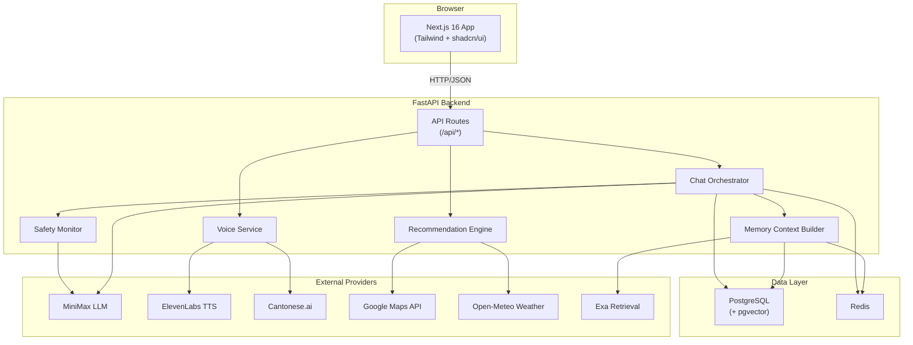

---

## 2. Tech Stack

| Layer | Technology |
|-------|-----------|
| Frontend | Next.js 16 (App Router), TypeScript 5.9, Tailwind CSS 4, shadcn/ui (Radix UI), Framer Motion |
| Backend | Python, FastAPI, Pydantic, SQLAlchemy 2.x, Alembic |
| Database | PostgreSQL 16 + pgvector extension |
| Cache | Redis 7 |
| AI/LLM | MiniMax (primary), LangGraph-capable runtime (feature-flagged) |
| Voice | ElevenLabs, Cantonese.ai |
| Maps/Weather | Google Maps API, Open-Meteo |
| Retrieval | Exa (optional) |
| Infra target | AWS (Amplify, ECS Fargate, RDS, ElastiCache) |

---

## 3. Frontend Architecture

### 3.1 Route Structure

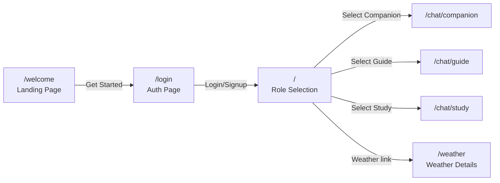

All pages are client components (`"use client"`). Unauthenticated users are redirected to `/welcome`.

### 3.2 Provider Tree

The root layout nests React context providers that supply global state to the entire component tree:

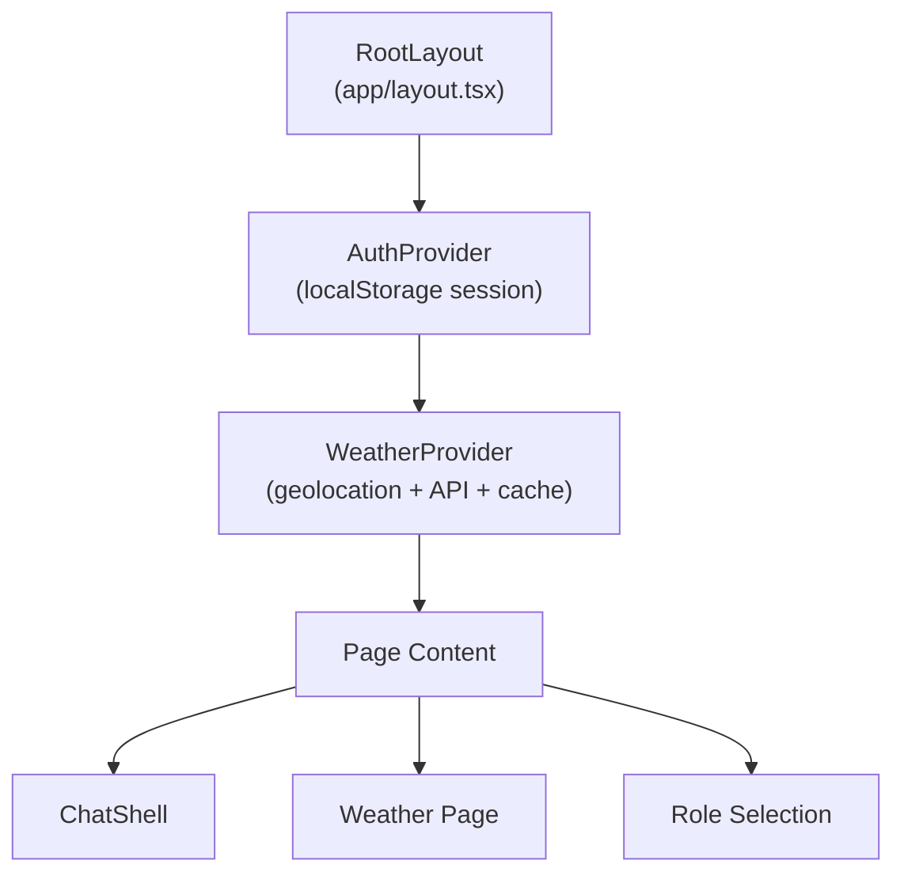

- **AuthProvider** manages login/signup/logout with localStorage persistence. Exposes `useAuth()` hook with `user`, `isLoading`, `login()`, `signup()`, `logout()`.
- **WeatherProvider** reads browser geolocation (2.5s timeout, falls back to Hong Kong coordinates), fetches weather from backend, caches in localStorage, and sets `data-weather` attribute on `<html>` for CSS theming. Exposes `useWeather()` with `condition`, `isDay`, `temperatureC`.

### 3.3 Design System

The visual design is driven by CSS custom properties defined in `globals.css`:

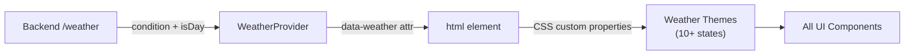

- **Weather themes**: `clear-day`, `clear-night`, `rain`, `cloudy`, `snow`, `fog`, `drizzle`, `thunderstorm`, `partly-cloudy-day`, `partly-cloudy-night`, and more.
- **Role colors**: `--role-companion`, `--role-local-guide`, `--role-study-guide` with associated accents.
- **Safety colors**: `--safety-bg`, `--safety-border`, `--safety-text` for crisis UI.
- **Typography**: Nunito (headings) + Nunito Sans (body), loaded as CSS variables.
- **Utilities**: glassmorphism classes, animation keyframes (`bubble-in`, `typing-dot`, `float`, `shimmer`).

### 3.4 Chat Architecture

`ChatShell` is the core interaction component (~1420 lines). It manages per-role state independently:

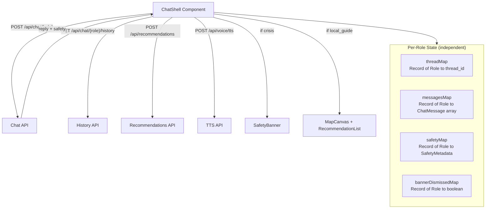

Key features:

- Message hydration from API on mount / role switch.
- Image attachments (JPEG/PNG/WebP, max 5MB, base64-encoded).
- Markdown rendering with `react-markdown` + `remark-gfm` + `rehype-sanitize`.
- Collapsible assistant thinking blocks.
- Per-message TTS playback with provider selection.
- Auto-scroll with floating action button.

### 3.5 API Client Layer

All API calls go through a thin client layer in `src/lib/api/`:

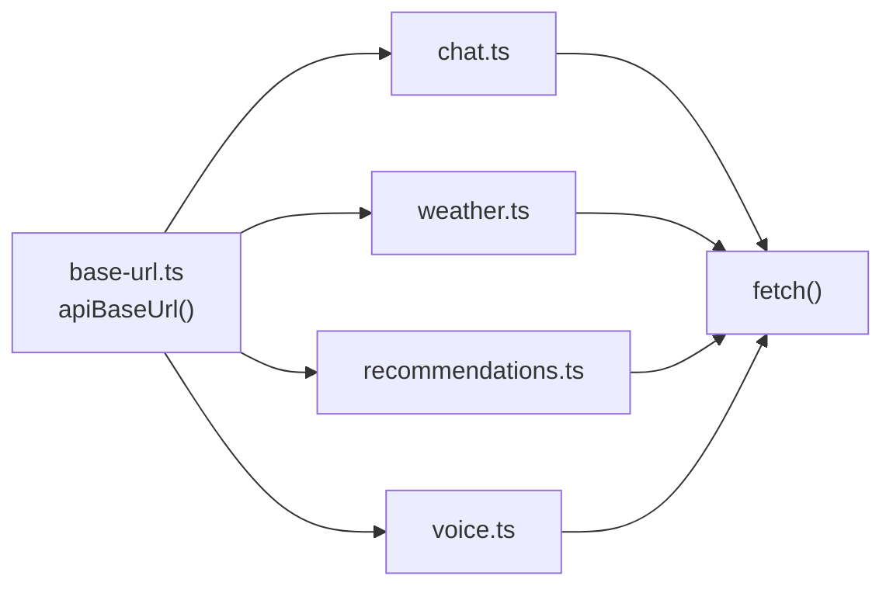

`apiBaseUrl()` reads `NEXT_PUBLIC_API_BASE_URL` (default `http://localhost:8000`), normalizes trailing slashes, and ensures the path ends with `/api`.

### 3.6 Role Routing

URL slugs map to internal role names via `role-routing.ts`:

| URL Slug | Internal Role |
|----------|---------------|
| `/chat/companion` | `companion` |
| `/chat/guide` | `local_guide` |
| `/chat/study` | `study_guide` |

Role switching uses Next.js `router.push()` to navigate between chat pages. Each role page hydrates its message history independently from the backend.

---

## 4. Backend Architecture

### 4.1 Application Entry Point

FastAPI application (`main.py`) configures CORS middleware and mounts all routers at dual prefixes (`/` and `/api/`), so both `/chat` and `/api/chat` resolve to the same handler.

### 4.2 Layered Architecture

```mermaid
graph TB
    subgraph routes ["API Routes Layer"]
        ChatRoutes["chat.py"]
        RecoRoutes["recommendations.py"]
        SafetyRoutes["safety.py"]
        VoiceRoutes["voice.py"]
        WeatherRoutes["weather.py"]
        HealthRoutes["health.py"]
    end

    subgraph services ["Service Layer"]
        ChatOrch["ChatOrchestrator"]
        RecoService["RecommendationService"]
        SafetyService["SafetyMonitorService"]
        VoiceService["VoiceService"]
        WeatherService["WeatherService"]
    end

    subgraph memory ["Memory Layer"]
        ContextBuilder["ConversationContextBuilder"]
        ShortTerm["Redis Short-Term"]
        LongTermProfile["Postgres Profile Memory"]
        LongTermRetrieval["pgvector Retrieval Memory"]
        FreshRetrieval["Exa Fresh Retrieval"]
    end

    subgraph runtime ["Runtime Layer"]
        Factory["RuntimeFactory"]
        SimpleRT["SimpleConversationRuntime"]
        LangGraphRT["LangGraphConversationRuntime"]
    end

    subgraph providerLayer ["Provider Layer"]
        Router["ProviderRouter"]
        MiniMaxP["MiniMaxChatProvider"]
        MockP["MockChatProvider"]
        ElevenLabsP["ElevenLabsVoiceProvider"]
        CantoneseAIP["CantoneseAIVoiceProvider"]
        GoogleMapsP["GoogleMapsProvider"]
        OpenMeteoP["OpenMeteoWeatherProvider"]
        ExaP["ExaRetrievalProvider"]
    end

    subgraph repos ["Repository Layer"]
        ChatRepo["ChatRepository"]
        MemoryRepo["MemoryRepository"]
        UserRepo["UserRepository"]
        RecoRepo["RecommendationRepository"]
        AuditRepo["AuditRepository"]
    end

    subgraph dataStores ["Data Stores"]
        PG["PostgreSQL + pgvector"]
        RD["Redis"]
    end

    ChatRoutes --> ChatOrch
    RecoRoutes --> RecoService
    SafetyRoutes --> SafetyService
    VoiceRoutes --> VoiceService
    WeatherRoutes --> WeatherService

    ChatOrch --> SafetyService
    ChatOrch --> ContextBuilder
    ChatOrch --> Factory
    ChatOrch --> Router
    ChatOrch --> ChatRepo
    ChatOrch --> MemoryRepo
    ChatOrch --> AuditRepo

    Factory --> SimpleRT
    Factory --> LangGraphRT

    ContextBuilder --> ShortTerm
    ContextBuilder --> LongTermProfile
    ContextBuilder --> LongTermRetrieval
    ContextBuilder --> FreshRetrieval

    Router --> MiniMaxP
    Router --> MockP
    Router --> ElevenLabsP
    Router --> CantoneseAIP
    Router --> GoogleMapsP
    Router --> OpenMeteoP
    Router --> ExaP

    RecoService --> Router
    VoiceService --> Router
    SafetyService --> Router

    ChatRepo --> PG
    MemoryRepo --> PG
    UserRepo --> PG
    RecoRepo --> PG
    AuditRepo --> PG
    ShortTerm --> RD
```

### 4.3 Chat Orchestration Flow

The `ChatOrchestrator` is the central coordination point for every chat message. Here is the full request lifecycle:

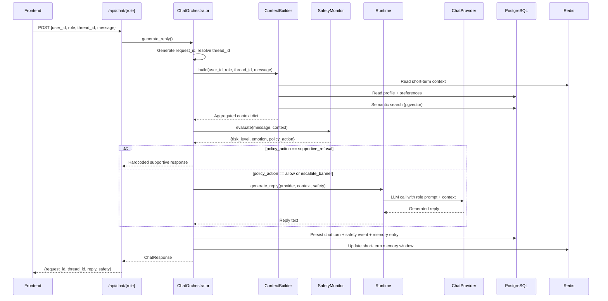

### 4.4 Runtime Selection

The runtime is selected at startup via the `FEATURE_LANGGRAPH_ENABLED` feature flag:

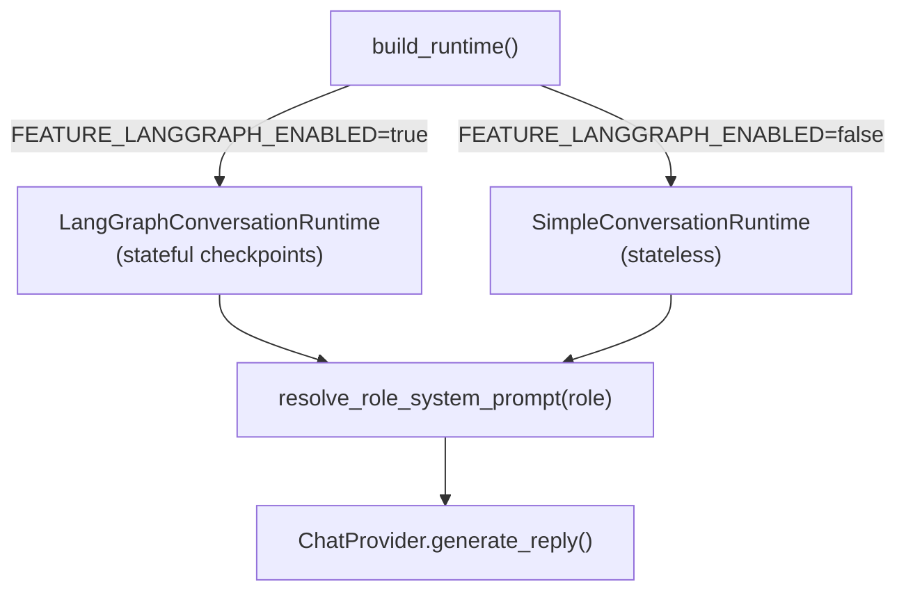

Both runtimes resolve role-specific system prompts from `app/prompts/role_prompts.py` and delegate to the configured `ChatProvider`. The LangGraph runtime additionally maintains thread-scoped conversation checkpoints in memory.

---

## 5. Provider Adapter System

Every external service is accessed through an adapter interface, resolved by the `ProviderRouter` based on feature flags and API key availability:

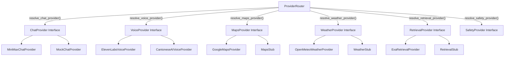

**Fallback rules**: When a provider's feature flag is disabled or its API key is missing, the router returns a stub/mock implementation that returns degraded but valid responses. This ensures the app never crashes due to a missing provider.

**Voice fallback chain**: The voice service tries providers in order (default: ElevenLabs then Cantonese.ai). The `preferred_provider` parameter can reorder the chain.

---

## 6. Memory System

CompanionHK uses a hybrid memory architecture combining four sources:

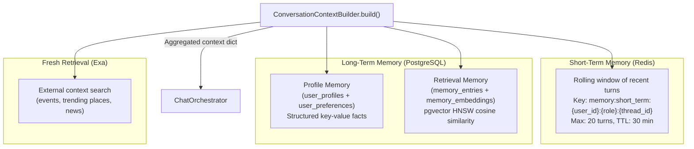

**Memory strategy** is controlled by `MEMORY_LONG_TERM_STRATEGY` (default: `hybrid_profile_retrieval`):

- **Profile memory**: Durable user preferences and facts stored as structured rows in PostgreSQL.
- **Retrieval memory**: Semantic search over `memory_entries` using pgvector with HNSW index and cosine similarity. Top-K configurable via `MEMORY_RETRIEVAL_TOP_K`.
- **Short-term memory**: Rolling conversation window in Redis with TTL, scoped by `(user_id, role, thread_id)`.
- **Fresh retrieval**: Optional Exa API call for current events and local context (feature-flagged).

Each memory source is independently degradable -- if Redis is down, short-term memory is marked `degraded` but the chat continues with long-term and fresh sources.

---

## 7. Safety System

Safety is a product requirement, not a stretch goal. Every chat message passes through the safety monitor before a reply is generated:

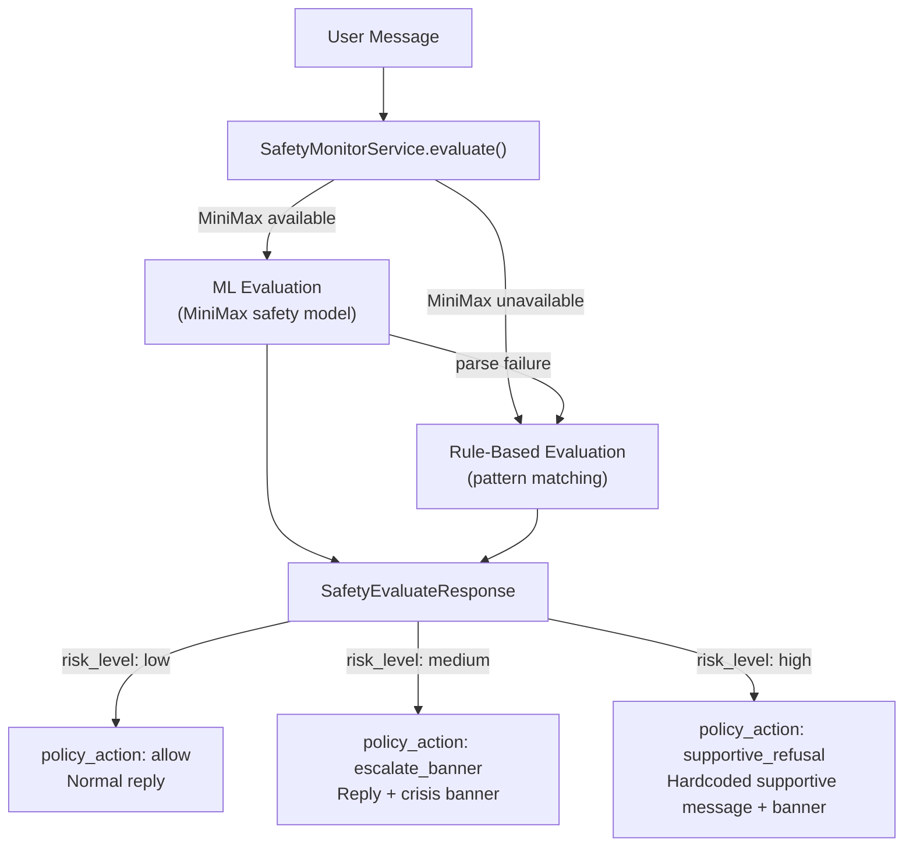

**Two-tier evaluation**:

1. **ML-based** (MiniMax safety model): Returns structured JSON with `risk_level`, `emotion_label`, `emotion_score`, and `policy_action`.
2. **Rule-based fallback**: Pattern matching against high-risk keywords in English and Chinese (suicide, self-harm indicators). Falls back automatically when MiniMax is unavailable or returns unparseable output.

**Crisis resources** displayed in the safety banner:

- The Samaritans Hong Kong: 2896 0000
- Suicide Prevention Services: 2382 0000
- The Samaritan Befrienders HK: 2389 2222
- Emergency Services: 999

Safety events are persisted to the `safety_events` table for audit.

---

## 8. Recommendation Engine

The Local Guide role generates location-based recommendations by combining multiple signals:

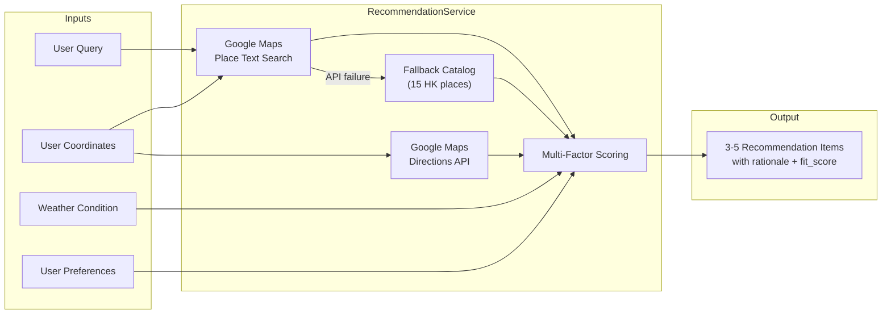

**Scoring algorithm** (weighted composite, deterministic):

| Factor | Weight |
|--------|--------|
| Query relevance | 25% |
| Rating score | 20% |
| Distance convenience | 20% |
| Review volume | 15% |
| Weather fit (indoor/outdoor) | 10% |
| Preference tag match | 10% |

Results are clamped to 3-5 items, each with a `fit_score` (0..1) and human-readable `rationale` explaining why it fits the user's current context.

---

## 9. Voice Pipeline

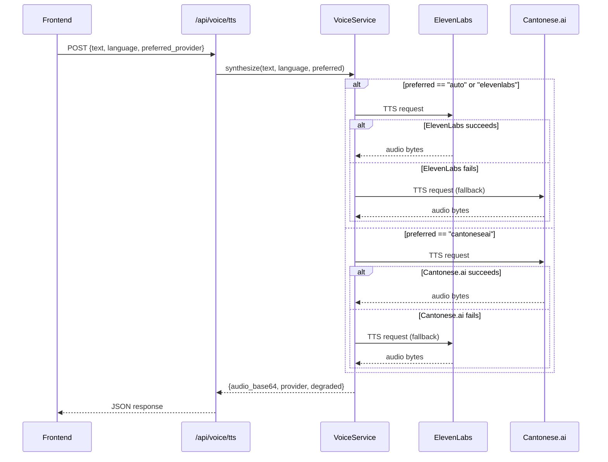

The voice service supports both TTS (text-to-speech) and STT (speech-to-text). Provider fallback order is determined by the `preferred_provider` parameter. All provider attempts are logged to the audit trail.

---

## 10. Database Schema

15 tables organized around role-scoped conversation continuity, hybrid memory, and comprehensive audit:

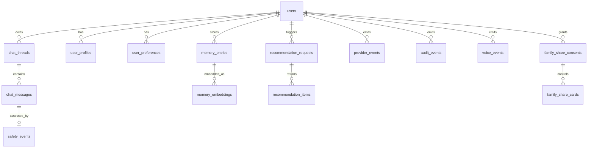

**Key design decisions**:

- Thread continuity scoped by `(user_id, role, thread_id)` with unique constraint.
- Recommendation requests store coarse location only (`user_location_geohash`) -- precise coordinates are never persisted for the user. Recommended places store precise coordinates for map rendering.
- `memory_embeddings` uses pgvector with HNSW index for fast cosine similarity search.
- All provider interactions logged to `provider_events` for observability and demo storytelling.

Migration toolchain: Alembic with SQLAlchemy 2.x models. Initial schema: `8f327fc4442f_create_initial_schema.py`.

---

## 11. Feature Flags

All provider activation and behavior selection is driven by environment flags:

| Flag | Default | Controls |
|------|---------|----------|
| `FEATURE_LANGGRAPH_ENABLED` | `false` | LangGraph vs simple runtime |
| `FEATURE_MINIMAX_ENABLED` | `false` | MiniMax LLM provider |
| `FEATURE_ELEVENLABS_ENABLED` | `false` | ElevenLabs voice |
| `FEATURE_CANTONESEAI_ENABLED` | `false` | Cantonese.ai voice |
| `FEATURE_EXA_ENABLED` | `false` | Exa retrieval |
| `FEATURE_GOOGLE_MAPS_ENABLED` | `false` | Google Maps places/routes |
| `FEATURE_WEATHER_ENABLED` | `false` | Open-Meteo weather |
| `FEATURE_SAFETY_MONITOR_ENABLED` | `true` | Safety evaluation |
| `FEATURE_VOICE_API_ENABLED` | `false` | Voice API endpoints |
| `FEATURE_AWS_ENABLED` | `false` | AWS integrations |
| `CHAT_PROVIDER` | `mock` | Primary chat provider selection |
| `MEMORY_LONG_TERM_STRATEGY` | `hybrid_profile_retrieval` | Memory strategy |

When a flag is disabled or an API key is missing, the corresponding provider degrades to a stub that returns valid but minimal responses.

---

## 12. Deployment Architecture (Target)

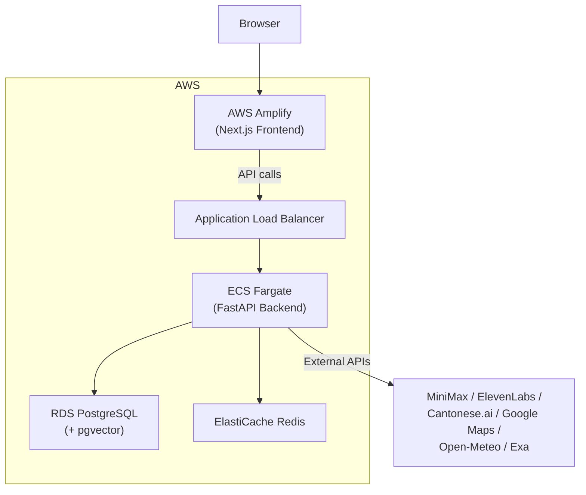

**Health probes for ECS/ALB**:

- `GET /health` -- liveness (process-level).
- `GET /ready` -- readiness (returns 200 only when PostgreSQL and Redis are reachable, 503 otherwise).
- `GET /health/dependencies` -- operational detail for all dependency states.

---

## 13. Key Design Patterns

| Pattern | Where Used |
|---------|-----------|
| **Adapter** | All external providers behind swappable interfaces |
| **Factory** | `build_runtime()` selects runtime implementation |
| **Router** | `ProviderRouter` centralizes provider resolution |
| **Orchestrator** | `ChatOrchestrator` coordinates safety, memory, provider, persistence |
| **Fallback Chain** | Voice providers, safety (ML then rules), maps (API then catalog) |
| **Repository** | Data access abstracted through typed repository classes |
| **Degradation** | Every service marks itself degraded rather than failing |
| **Audit Trail** | All operations logged to `AuditRepository` and `provider_events` |
| **Feature Flag** | All providers and runtimes toggled via environment variables |
| **Role Isolation** | Conversation state scoped by `(user_id, role, thread_id)` |
