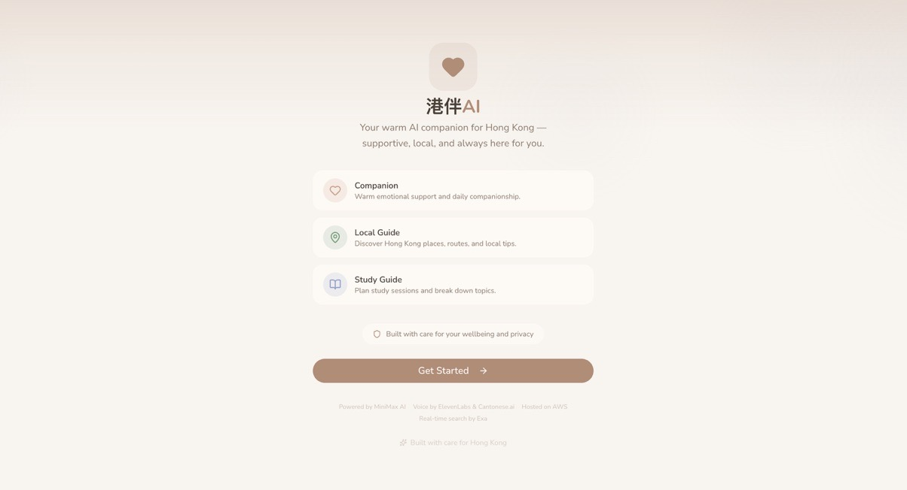

# CompanionHK (`港伴AI`)

CompanionHK is an AI companion app for Hong Kong users with three role spaces: `Companion`, `Local Guide`, and `Study Guide`, focused on safety and practical daily support.

## Tech Stack

- `frontend/`: Next.js 16 (App Router) + TypeScript + Tailwind CSS 4 + shadcn/ui + Framer Motion
- `backend/`: FastAPI + Pydantic orchestration API
- `infra/`: Local PostgreSQL (pgvector) + Redis development stack

## Architecture Highlights

- Multi-page frontend: `/welcome` (landing), `/login` (auth), `/` (role selection), `/chat/[role]` (chat), `/weather` (weather details).
- localStorage-based auth via `AuthProvider` context (hackathon scope).
- Provider adapters with `MiniMax` as the core model route, feature-flagged.
- Stateful orchestration through a LangGraph-capable runtime boundary (feature-flagged).
- Hybrid long-term memory: Postgres profile memory + pgvector retrieval memory.
- One chat model route with role-specific prompts and role-scoped thread spaces.
- Safety monitor with two-tier evaluation (MiniMax + rules fallback) and crisis banner UX.
- Weather-adaptive UI theming via CSS custom properties and `WeatherProvider` context.
- Voice pipeline: ElevenLabs + Cantonese.ai with adapter-based fallback.
- Local recommendations: Google Maps places + routes, weather context, preference scoring, optional Exa retrieval.

## Quick Start

1. Copy environment template:
   - `cp .env.example .env`
2. Start local infra:
   - `docker compose -f infra/docker-compose.yml up -d`
3. Apply database migrations:
   - `cd backend && uv run alembic upgrade head && cd ..`
4. Run backend (choose one):
   - `venv`: `cd backend && python3 -m venv .venv && source .venv/bin/activate && pip install -e '.[dev]' && uvicorn app.main:app --reload --port 8000`
   - `uv`: `cd backend && uv sync --all-extras && uv run uvicorn app.main:app --reload --port 8000`
   - `conda`: `cd backend && conda env create -f environment.yml || conda env update -f environment.yml --prune && conda run -n companionhk-backend uvicorn app.main:app --reload --port 8000`
5. Run frontend:
   - `cd frontend && npm install && npm run dev`
6. Open `http://localhost:3000` — you will land on the welcome page, then log in and select a role.

### Environment Variables

Minimum for local preview:

- `NEXT_PUBLIC_API_BASE_URL=http://localhost:8000`
- `CHAT_PROVIDER=mock` (or `minimax` with `MINIMAX_API_KEY`)

Optional for richer Local Guide experience:

- `GOOGLE_MAPS_API_KEY` (backend places + routes)
- `NEXT_PUBLIC_GOOGLE_MAPS_API_KEY` (frontend map canvas)

See `.env.example` for the full list of feature flags and provider keys.

## Development Commands

- Backend tests:
  - `venv`: `cd backend && source .venv/bin/activate && pytest -q`
  - `uv`: `cd backend && uv run pytest -q`
  - `conda`: `cd backend && conda run -n companionhk-backend pytest -q`
- Frontend tests:
  - `cd frontend && npm run test`

## Frontend Routes

| Path | Purpose |
|------|---------|
| `/welcome` | Landing page |
| `/login` | Login / signup |
| `/` | Role selection (protected) |
| `/chat/companion` | Companion chat |
| `/chat/guide` | Local Guide chat |
| `/chat/study` | Study Guide chat |
| `/weather` | Weather details |

## Documentation

- **Architecture overview**: `ARCHITECTURE.md` (design, diagrams, data flows)

## Integration Contracts

- Weather API usage: `docs/integrations/open-meteo.md`
- Google Maps API usage: `docs/integrations/google-maps.md`
- Recommendation and weather app contract: `docs/architecture/recommendation-contract.md`
- Database schema: `docs/architecture/database-schema.md`
- Role system: `docs/architecture/role-system.md`
- Full tech stack: `docs/TECHSTACK.md`
