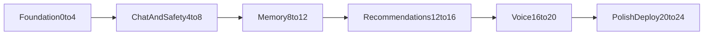

# CompanionHK 24-Hour Roadmap

This roadmap is optimized for a 3-4 person hackathon team.

## 1) Team Roles

- Frontend Lead:
  - Next.js + Tailwind + shadcn/ui app shell,
  - role-space chat UI, safety banner UI, recommendation cards,
  - dynamic weather/emotion theme behavior.
- Backend Lead:
  - FastAPI endpoints, orchestration, memory APIs,
  - role-aware chat contract, safety policy gate, and provider adapters.
- Integration Lead:
  - MiniMax route, Google Maps, weather, voice providers,
  - role prompt routing, emotion/risk monitor, and recommendation ranking logic.
- Optional DevOps Lead (if 4th person available):
  - AWS deployment path, env setup, logs/metrics wiring.

## 2) Critical Path

Core dependency rule:

- Do not start advanced recommendations or voice before chat + safety baseline is stable.

## 3) Time-Blocked Execution Plan

## Hour 0-4: Foundation and Scaffolding -- DONE

- Frontend Lead:
  - initialize Next.js App Router + TypeScript + Tailwind CSS + shadcn/ui,
  - build role-space chat shell (message list, composer, loading/error states),
  - add role selector for `Companion` / `Local Guide` / `Study Guide`,
  - add theme context skeleton.
- Backend Lead:
  - scaffold FastAPI service and health route,
  - define provider adapter interfaces,
  - add `/chat` endpoint with mocked response and `role` + `thread_id` contract.
- Integration Lead:
  - scaffold LangGraph-capable runtime boundary behind feature flag,
  - keep MiniMax adapter path active under both simple and LangGraph runtimes.
  - scaffold role-specific prompt templates on the shared model route,
  - configure Google Maps + weather API stubs,
  - configure MiniMax adapter skeleton,
  - set up voice adapter contracts.
- DevOps Lead:
  - provision local dev stack for Postgres + Redis,
  - define environment variable template.

Deliverable:

- Role-space chat UI can call backend and receive mocked responses for all three MVP roles.

## Hour 4-8: Chat and Safety Baseline -- DONE

- Frontend Lead:
  - connect real role-aware chat endpoint,
  - implement anti-suicide banner and crisis resources panel.
- Backend Lead:
  - add role-specific system prompts and refusal policy layer,
  - implement safety decision API,
  - wire safety context into runtime state for each role-scoped `thread_id`.
- Integration Lead:
  - wire MiniMax model route shared by all roles,
  - implement emotion/risk scoring path (small model/process),
  - pass safety context to primary chat route.

Deliverable:

- End-to-end multi-role chat with dangerous-input refusal and visible safety banner.

## Hour 8-12: Memory Layer -- DONE

- Frontend Lead:
  - preference capture UI (tone, topics, locale hints).
- Backend Lead:
  - implement short-term memory in Redis with TTL (role-scoped),
  - implement long-term profile memory schema in Postgres.
- Integration Lead:
  - add embeddings + pgvector retrieval path for extra materials and fuzzy recall,
  - add memory summarization for long sessions.

Deliverable:

- Chat behavior reflects recent role-space conversation and saved preferences.

## Hour 12-16: Recommendation Engine -- DONE

- Frontend Lead:
  - build recommendation cards and reasoning text UI,
  - show weather/emotion context in UI.
- Backend Lead:
  - add recommendation orchestration endpoint.
- Integration Lead:
  - integrate Google Maps Places + routing signals,
  - integrate weather source and preference scoring,
  - add optional Exa freshness enrichment.

Deliverable:

- Returns 3-5 localized recommendations with mood/context rationale.

## Hour 16-20: Voice Pipeline -- DONE

- Frontend Lead:
  - build voice input/output controls and playback.
- Backend Lead:
  - add voice request/response endpoints.
- Integration Lead:
  - wire ElevenLabs path,
  - wire Cantonese.ai path,
  - implement provider fallback behavior.

Deliverable:

- At least one reliable voice conversation path works in demo.

## Hour 20-24: Polish, Deploy, and Demo Hardening -- IN PROGRESS

- Frontend Lead:
  - warm visual polish, responsive checks, final theme tuning.
- Backend Lead:
  - stabilize error handling and logs.
- Integration Lead:
  - verify sponsor usage paths and fallback behavior.
- DevOps Lead:
  - deploy frontend/backend/data stack on AWS target path,
  - run smoke test in deployed environment.

Deliverable:

- Demo-ready build with scripted happy path and safety path.

## 4) Risk-Cut Strategy (If Behind Schedule)

Cut order while preserving core value:

1. Defer advanced animations and non-critical UI polish.
2. Limit voice to one provider path first.
3. Disable Exa enrichment and keep Google Maps + weather only.
4. Defer semantic vector tuning; keep basic long-term memory writes.
5. Keep Family Mode as post-MVP stretch only.

Never cut:

- Multi-role chat baseline.
- Safety refusal + crisis escalation UX.
- Basic memory context.

## 5) Daily Checkpoints

- Checkpoint A (Hour 4): role-space chat shell + role-aware mock backend done. -- PASSED
- Checkpoint B (Hour 8): safety behavior working. -- PASSED
- Checkpoint C (Hour 12): memory persistence working. -- PASSED
- Checkpoint D (Hour 16): recommendations working. -- PASSED
- Checkpoint E (Hour 20): voice baseline working. -- PASSED
- Checkpoint F (Hour 24): deployment + demo script finalized. -- IN PROGRESS

## 6) Demo Readiness Checklist

- User can chat privately in three role spaces (`Companion`, `Local Guide`, `Study Guide`).
- Dangerous prompts trigger refusal and support banner.
- AI remembers recent context and user preferences.
- Recommendations are localized and context-aware.
- Voice flow works on at least one provider.
- Sponsor integrations are demonstrable in the walkthrough.
